# ReadWrite

ReadWrite is a website for the user-submission of news articles, and the discussion thereof. Unlike internet forums, or websites such as Reddit, neither questions nor forms of media other than links to articles on news sites can be submitted.

In time, and as its userbase grows, we hope that ReadWrite will become a go-to source for the latest stories from news outlets across the internet - a central hub for all news as it happens. Reddit is known for how fast its countless subreddits' users are when it comes to posting updates about a given topic - we want ReadWrite to harness that same speed for the sharing of news stories, especially those that are evolving. In the modern world, each and every person is surrounded by things that are competing for their attention - if you let even a second pass, you have lost them. For many, a news story ends at this point, even though it might continue to evolve, unbeknownst to them. We want to make sure that people stay informed and up-to-date.

We live in a divided world, and somewhere along the way, we seem to have lost our shared reality. By centralising news at ReadWrite, we hope to contribute to the efforts to rebuild this shared reality. We want everyone to be in the same place getting the same information, and to be seeing the whole picture.

## Technologies used
<ul>
    <li>HTML</li>
    <li>CSS</li>
    <li>JavaScript</li>
    <li>Markdown</li>
    <li>Git</li>
    <li>GitPod</li>
    <li>GitHub</li>
    <li>Bootstrap 5</li>
    <li>Python</li>
    <li>PostgreSQL</li>
    <li>psycopg2</li>
    <li>Django</li>
    <li>ElephantSQL</li>
    <li>Cloudinary</li>
    <li>Heroku</li>
</ul>

## Features

### Existing features

<strong>Header with navigation bar</strong>

The header at the top of the page contains the site logo, as well as a navbar whose primary function is enabling the user to interact with the accounts side of the site. If they are not logged in, the Login option will be visible to them, whereas if they are logged in, Logout will be visible.
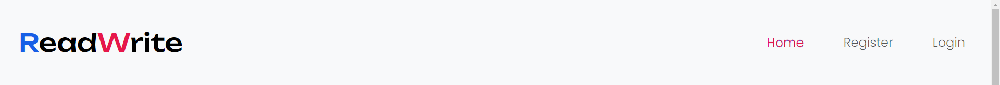
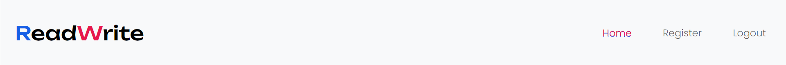

<strong>Login, Logout, and Register pages</strong>

Through the navbar links mentioned above, the user can access the following pages:
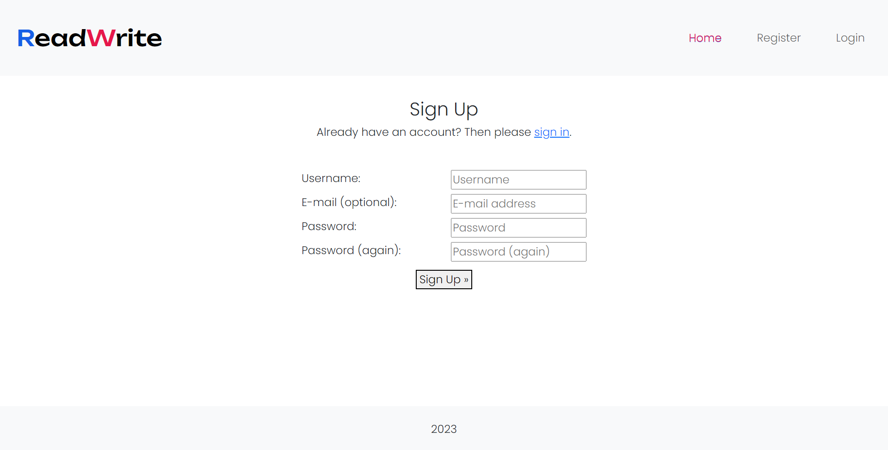
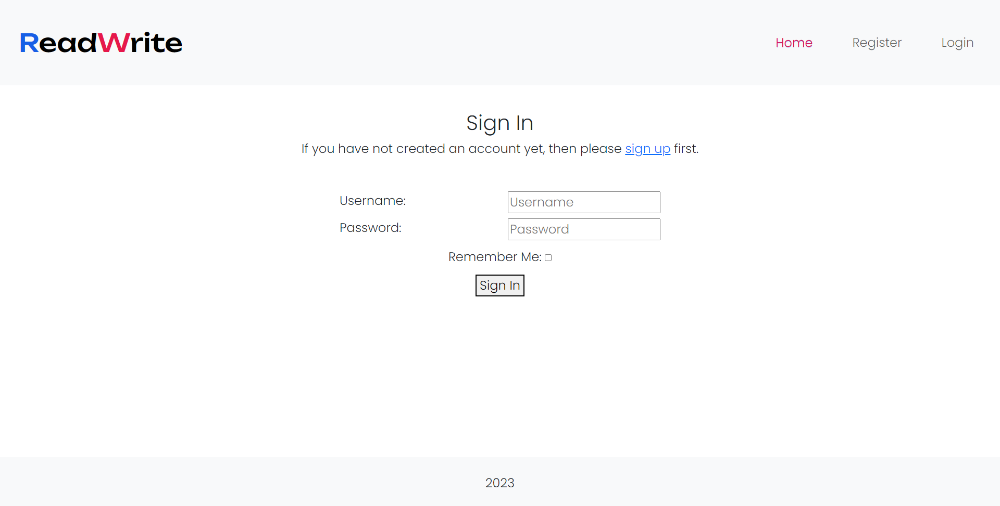
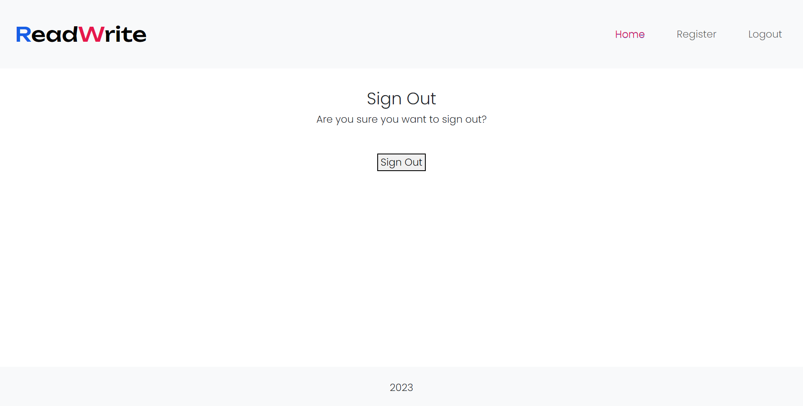

<strong>Main Page - list of bulletins</strong>

When the user navigates to the site's main URL, they will be presented with this page, and its appearance will differ slightly depending on whether or not the user is logged in. In either case though, it will display a list of links to bulletins that have been posted to the site:
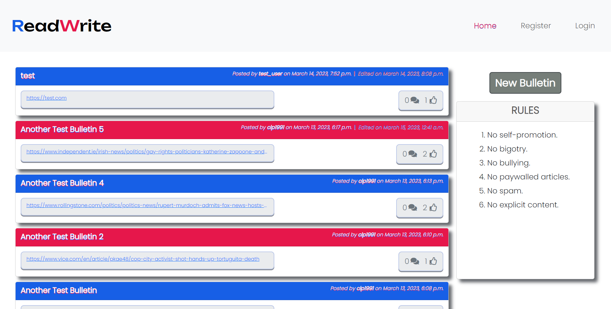

And below is how the site should appear if the user is logged in:
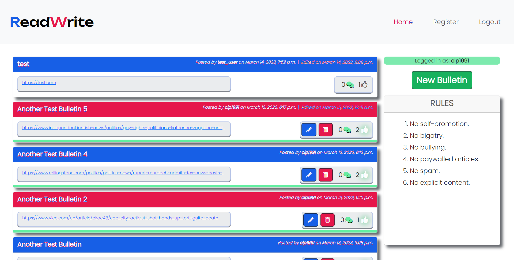

Logged in, a user can post bulletins, leave comments on bulletins (including their own), edit and delete their own bulletins and comments, and leave likes on the bulletins and comments of their own and of others. As you can see from the screenshots above, the New Bulletin button becomes green, and the like button becomes less grey. Furthermore, any bulletins added by the user are underlined in green, and edit and delete options become available for them. The comments icon becomes green, as well, which should communicate to the user that they are now able to leave comments (note that the number next to the comments icon ticks up as more comments are added to the bulletin). Finally, some text appears above the New Bulletin button telling the user which user is currently logged in.

At any given time, the ten most recently posted bulletins will be visible on the main page. By clicking the "Next" or "Prev" buttons at the bottom of the page, the user can view older bulletins:
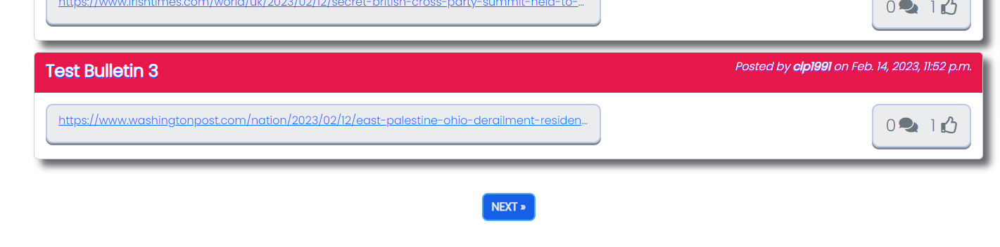
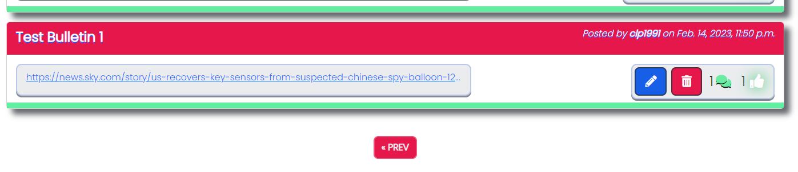

Together with the rules and the New Bulletin button, the above message actually follows the scroll bar of the page so that the user always knows who is logged in, as well as what the sites code of conduct is. The close proximity of the New Bulletin button means that there is little friction between them and making a post. News is always breaking, so it is useful to be able to post it as quickly as possible. In the image below, you can see this scrolling behaviour (the side section has followed the scrollbar down the page):
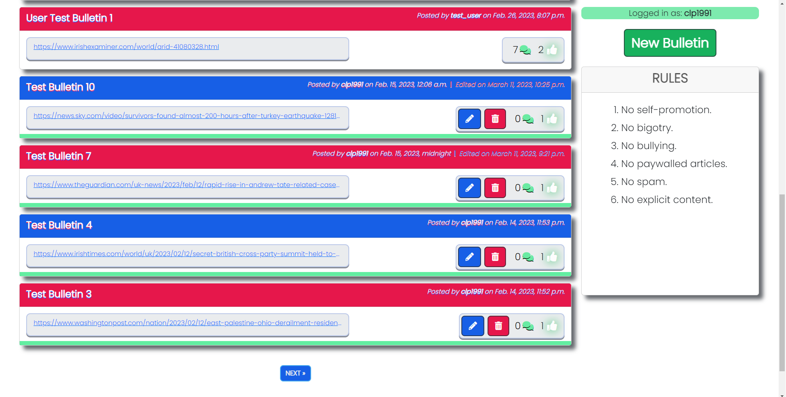

<strong>Bulletin page with comment section</strong>

If the user clicks on a bulletin from the main page, they will be taken to that bulletins individual page. Here, they can view the bulletin in full, as well as any comments left on it. By "in full", I am referring to the fact that a user can add a remark of their own to the bulletin they wish to post, and this remark can only be seen on the bulletins own page.

Similarly to the main page, this page also has a slightly different appearance to logged on and logged off users:
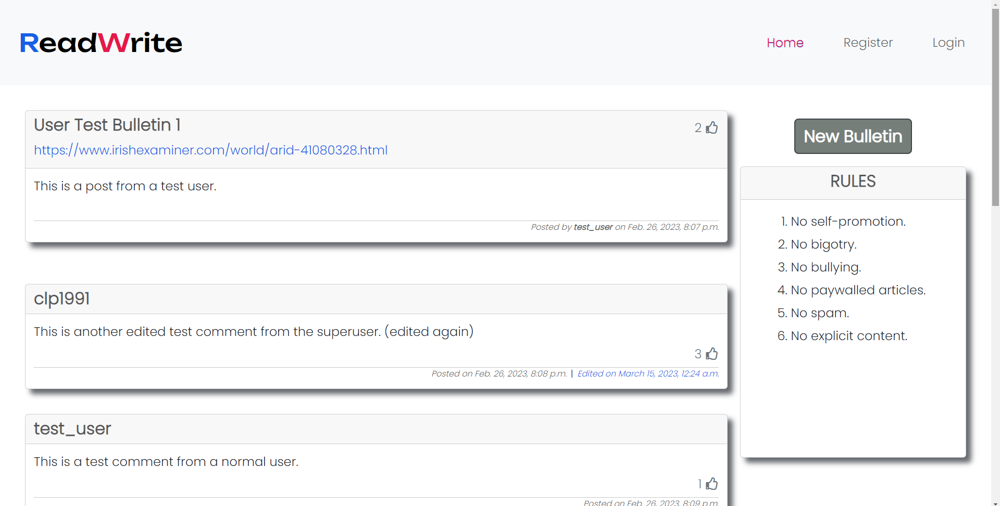
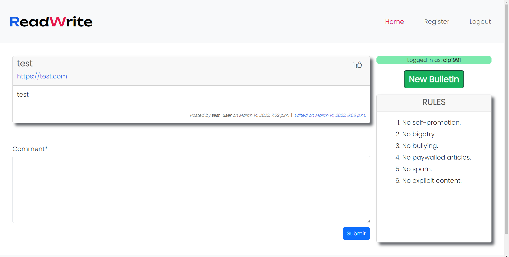

Logged in users can make use of the comment form on a bulletin page, whereas for users who are not logged in, this form is not visible. You will also notice that the side-section from the main page is also included on a bulletins page. It has the same scrolling behaviours on this page as well. I felt it was wise to have this section be almost omnipresent across the site so that users are constantly being reminded of the code of conduct. It is hard to police the internet, but I would hope that a feature like this would make people think twice before being inflammatory or inappropriate - something which is more likely when discussing what's in the news.

As can be seen in the screenshots above, the like button on a bulletin becomes a darker colour to the logged in user, and is greyed out otherwise. Much like the main page then, edit and delete buttons will also appear for any posts or comments made by the logged in user.
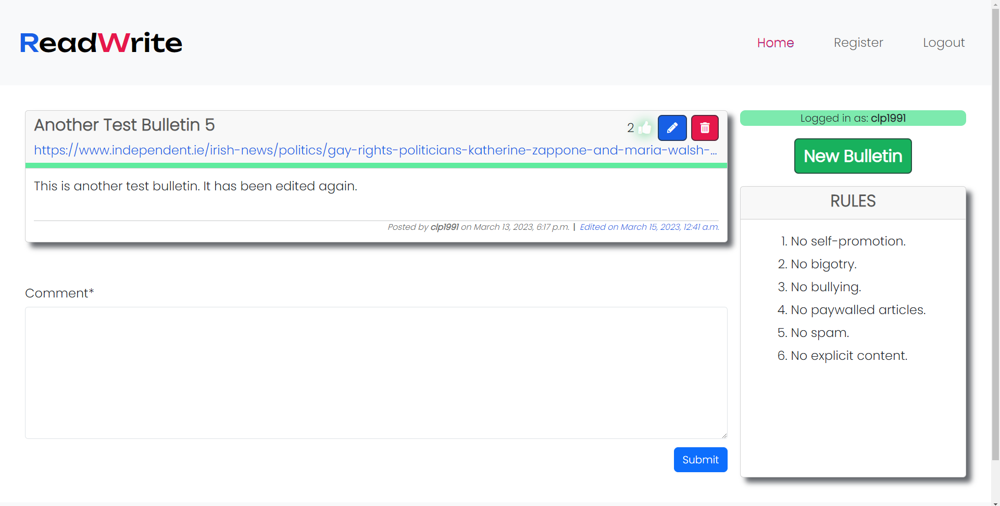

Above, you can see how said buttons have appeared alongside the like button for the button. Also note the green line - this indicates that the post was made by the logged in user. Green lines can be found on anything across the site that was submitted by the logged in user. They can also be seen on some of the bulletins in one of the screenshots of the main page above. Below is a screenshot of a bulletins comment section, some comments of which were made by the logged in user, and some of which were not:
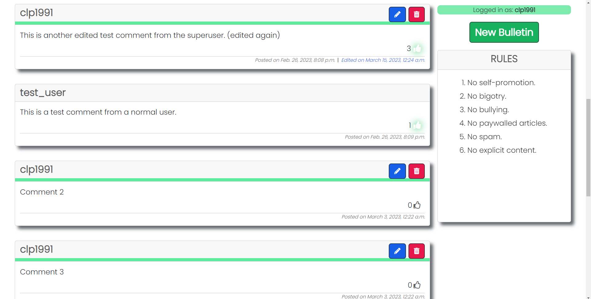

<strong>The add and edit bulletin pages</strong>

As mentioned above, new bulletins can be added, and existing bulletins can be edited. Only logged in users can add bulletins, and of those logged in users, only the user who posted a given bulletin can edit it. The large, green "New Bulletin" button takes a user to the page where they can add a new bulletin, and the blue button with the pencil icon on it enables a user to edit an existing bulletin. On the main page, the latter button appears on bulletins that the logged in user has posted, and if they click into one of those bulletins, they will also find the button on that bulletins page.

The add and edit bulletin pages are almost identical. The only difference between them is that the edit page is pre-populated with the text from the bulletin being edited.
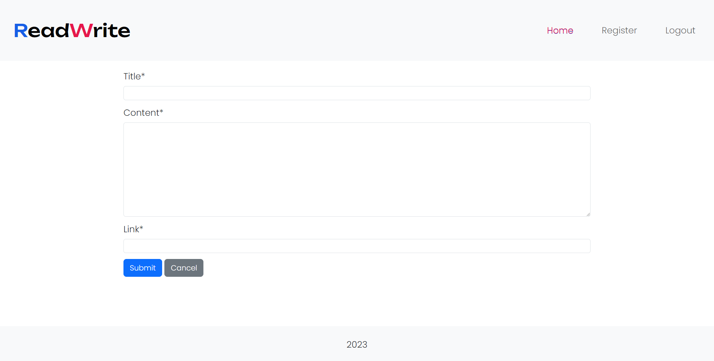
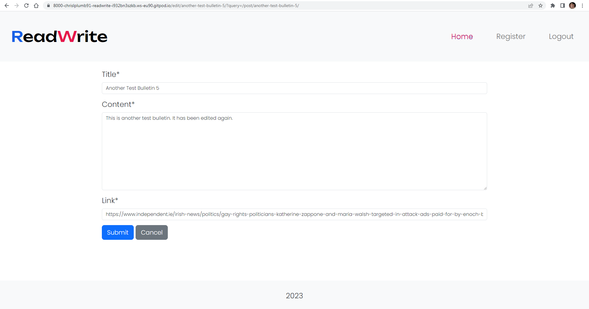

Note that a bulletin will not appear on the site as soon as it is submitted. It must be approved by the site administrator. This can be done by a superuser from the Django admin panel.

<strong>Comment editing</strong>

From a given bulletin page, it is possible for a user to edit any comments they have left on it. If a comment was made by the logged-in user, the blue button with the pencil icon on it will be visible on the comment itself. Clicking this button populates the comment form just below the bulletin with the user's comment. Changing the text and clicking the submit button will edit the comment, and this change will immediately be reflected in the comment itself.
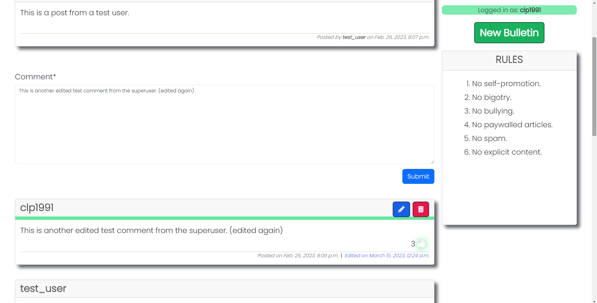

<strong>Deleting bulletins and comments</strong>

Users may also delete any bulletins or comments that they post. They can do this by clicking the red button with the bin icon on it. This button appears alongside the edit button on any posts made by the user.

Clicking a delete button causes a modal to appear. This modal contains a dialog box that asks the user to confirm whether or not they want to delete the item. This is necessary in order to avoid any accidental deletions. Only when the user clicks "Yes, delete" does the item actually get deleted.

In the case of bulletins, the modal will appear over whichever page the user clicks the delete button from, i.e. either the main page, or a bulletins page.
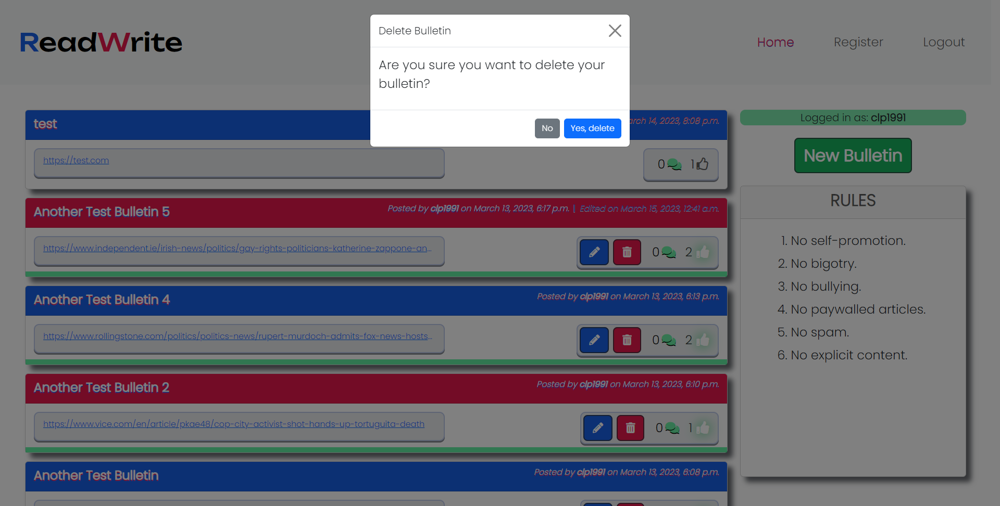
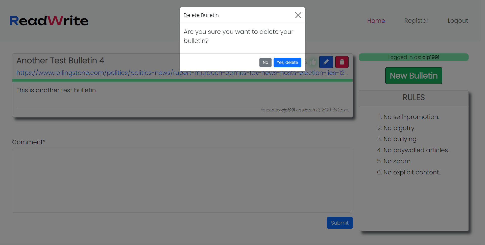
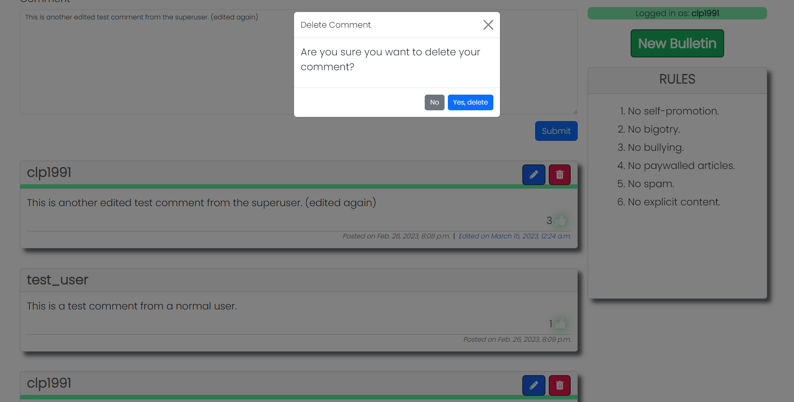

<strong>Liking and unliking</strong>

Both bulletins and comments on bulletins can be liked by users. Each user can give one like per post, including to their own posts, but they must be logged in to do so. The like count for a post ticks up by one if a like is given to it by a user, and if the user clicks on the like button for that post again, their like will be removed.

The like button glows green when a like is given, and will stay that way until a user undoes it.

A bulletin can be liked from the main page if it can be found on the list, and it can be also liked from its own page, but liking it from one location will also like it in the other. Comments only exist on bulletin pages, and so the user has to navigate to a specific bulletin page to give likes to its comments. Comments are ordered from most liked to least liked, with the most liked comment displaying directly below the comment form.

Below are screenshots of bulletins being liked and unliked on both the main page and on a bulletin page:
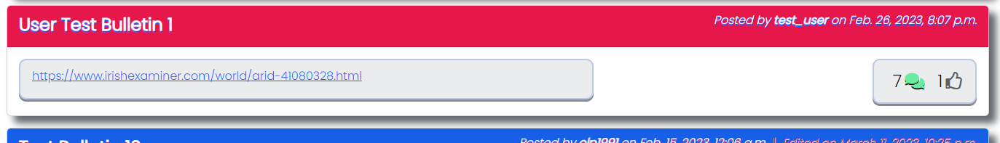
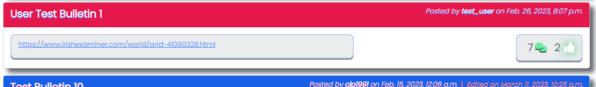
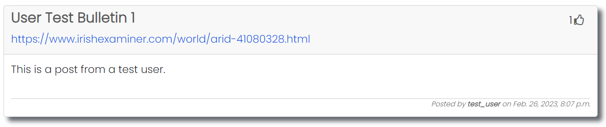
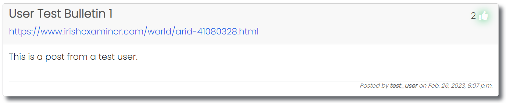

And below are screenshots of a comment being liked:
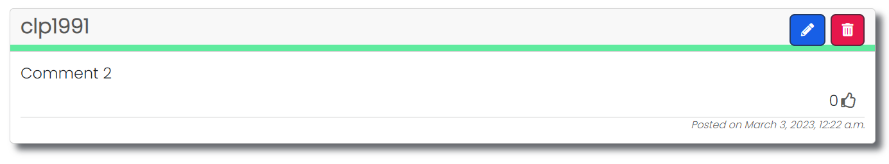
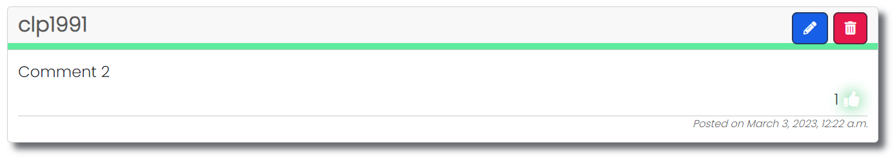

<strong>Informational messages</strong>

Lastly, the site displays informational messages to the user along the middle of the header / navbar when they perform certain actions. Two of these are built in to Django, and appear when the user logs in, logs out, or creates an account, but the rest are unique to the site. 

Below are screenshots of the messages that appear, and descriptions of what triggers them:
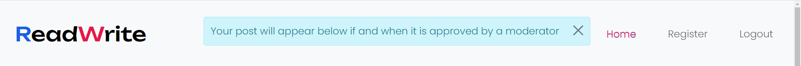
The above message appears after a user submits a new bulletin. Without it, their post would not appear on the list on the main page, and it would not be clear to them whether or not it had submitted successfully.

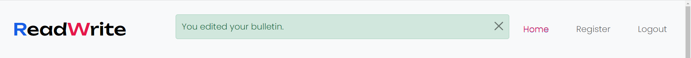
The above message appears after a user submits an edit to one of their bulletins. This can be confirmed by simply viewing the bulletin, but this would require that they find it and click on it if they are on the main page.

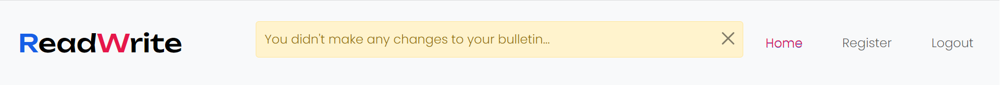
The above message appears in the edit bulletin form if the user attempts to submit an edit bulletin form without making any changes to the bulletin details. To leave this page, the user can either click Cancel, or click the back button in their browser.

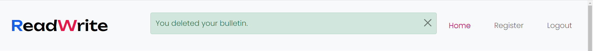
The above message appears after a user clicks "Yes, delete" on the modal that appears when the delete button for a bulletin is clicked. This could also be confirmed by looking for the bulletin from the main page, but this could very easily become onerous if there were many bulletins to sift through.

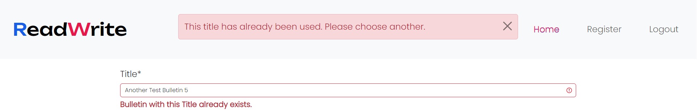
The above message appears in either the add or edit bulletin forms if the user tries to give their bulletin a title that another bulletin on the site already has. Bulletin titles must be unique. This goes a short way towards preventing duplication on the site.

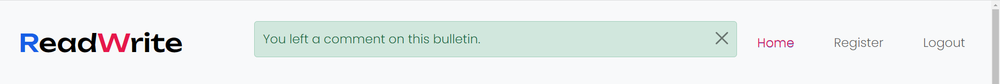
The above message appears after a user adds a comment to a bulletin. Unlike bulletins, comments do not need approval from the site adminstrator.

The above message appears on a bulletin page after a user has edited a comment.

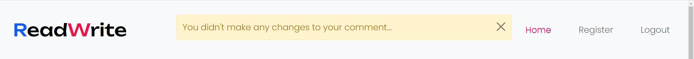
The above message appears on a bulletin page if the user attempts to submit a comment from the comment edit form without making any changes to it.

Finally, the above message appears on a bulletin page if the user deletes one of their comments from that page.

### Features yet to be implemented

<strong>Sections for different topics</strong>

Obviously, a site like this would become very hard to manage and to navigate very quickly if even just a few users started posting links to it frequently. Finding a bulletin that the user read earlier would be very tedious, as not only would it be easy to overlook it because of how the site looks, but the user would potentially have to view over a dozen pages to find it. This search process could be made far less onerous by dividing the site into broadly different sections for different topics, for example, politics, science, art, music, television, film, sports, and so on.

<strong>Bulletin search bar</strong>

This would make finding a bulletin significantly easier, whether it was one that the user wished to read again or comment on, or one that they wanted to post or talk to other users about, but were not sure whether or not it had already been posted. A search bar such as this would not require exact titles, but only words that would be matched to titles.

<strong>Bulletin tags</strong>

A tag system would be useful for categorising bulletins and making them easier to search for (with the above search bar). A bulletin could be related to a specific topic or news story, but might have a title that wasn't descriptive. Tags could be required when submitting a bulletin. A political article could have the politics tag, among others, for example.

<strong>Profile features</strong>

A profile system not unlike that of Reddit's would be welcome. Through this, the user could track which bulletins and comments they liked, as well as track bulletins they posted, and comments they left on bulletins.

<strong>Reply / conversation system in comment section</strong>

A feature like this would better facilitate discussion in the comment sections of bulletins. It would be easier to tell who was talking to who.

<strong>Notifications</strong>

Notification of a comment having just been left on a user's bulletin would promote discussion between users, as would notifications for replies to comments (see above). Without a feature like this, comment sections would very quickly become deserted. The user who posted the bulletin would probably miss any comments left on it, and wouldn't respond to anyone, and likewise, commenters would not be aware of replies to their own comments.

<strong>Automated bulletin approval</strong>

I mentioned above that the ever-present New Bulletin button enables quicker creation of bulletins, but this is defeated by the fact that an administrator has to approve all such submissions. Therefore, ideally, approval would be an automated process. The submission would be put through a filter, and posted to the site if no inappropriate content was found. This process could be greatly improved by the implementation of artificial intelligence, which would better understand context, and this would hopefully prevent the rejection of legitimate submissions.

## Testing
<em>Please refer to TEST.md</em>

## Deployment

The process I followed to deploy this project is as follows:
<ol>
    <li>I began by creating a new Heroku app, making sure to set its region to Europe.</li>
    <li>Next, I created a new database instance in ElephantSQL, choosing the Tiny Turtle plan, and selecting an Irish data centre.</li>
    <li>I copied the database URL on the details page for the above database instance, and pasted it into env.py as an environmental variable using os.environ['DATABASE_URL']</li>
    <li>In settings.py in my Django files, I added the following imports: import os, import dj_database_url, and import env within if os.path.isfile('env.py'):</li>
    <li>In the user settings of the GitPod workspaces page, I created a new variable called SECRET_KEY, setting it to a randomly generated Django secret key, and setting its scope to chrislplumb91/readwrite</li>
    <li>Back in settings.py, I added the line os.environ.get('SECRET_KEY'), and provided a blank string as a second argument. My app would now pull the secret key from the GitPod environment, rather than from my env.py file.</li>
    <li>At this point, I stopped and started my workspace.</li>
    <li>Still in settings.py, I added this line: DATABASES = {'default': dj_database_url.parse(os.environ.get("DATABASE_URL"))}, and commented out the default sqlite3 database used by Django. At this point, the app was now connected to the remote ElephantSQL database.</li>
    <li>I used the CLI command python3 manage.py migrate to migrate my database models and data to the remote ElephantSQL database.</li>
    <li>In the settings for my Heroku app, I expanded the Config Vars section. Here, I added the DATABASE_URL environmental variable created above as a config var for the Heroku app, and with the exact same value. This connected my Heroku app to the ElephantSQL database.</li>
    <li>Next, I added a SECRET_KEY config var to my Heroku app, setting it to a different randomly generated Django secret key.</li>
    <li>For reasons of compatibility with Python, I next added a Heroku config var called PORT, and set it to 8000.</li>
    <li>Next, I logged in to Cloudinary, and on the dashboard, I copied the API environment variable.</li>
    <li>Back in env.py, I added os.environ['CLOUDINARY_URL'], and set it to the copied API environment variable.</li>
    <li>Over in my Heroku app, I added the same CLOUDINARY_URL environmental variable as a config var.</li>
    <li>In my Django project's settings.py file again, I added 'cloudinary', and 'cloudinary_storage' to the INSTALLED_APPS list</li>
    <li>Further down in settings.py, I added the following lines: STATICFILES_STORAGE = 'cloudinary_storage.storage.StaticHashedCloudinaryStorage', STATICFILES_DIRS = [os.path.join(BASE_DIR, 'static')], STATIC_ROOT = os.path.join(BASE_DIR, 'staticfiles'), MEDIA_URL = '/media/', and DEFAULT_FILE_STORAGE = 'cloudinary_storage.storage.MediaCloudinaryStorage'. Together, these lines instructed Django to use Cloudinary to store my project's static files.</li>
    <li>Next, I created a Procfile for Heroku in the root directory of my project in GitPod, and within it, I added the line 'web: gunicorn codestar.wsgi'. This enabled gunicorn to handle HTTP requests in my Heroku app the same way that runserver does in GitPod.</li>
    <li>In settings.py, I added the line X_FRAME_OPTIONS = 'SAMEORIGIN' in order to permit the loading of Django Summernote.</li>
    <li>From the CLI in GitPod, using the command pip3 freeze --local > requirements.txt, I created a requirements.txt file.</li>
    <li>In my projects requirements.txt file, I added the following to the end of backports.zoneinfo==0.2.1: ;python_version<"3.9". I found this was necessary for my project to deploy to Heroku successfully.</li>
    <li>Next, from GitPod, I ran the command python3 manage.py collectstatic in order to send copies of my static files to Cloudinary.</li>
    <li>In the user settings of the GitPod workspaces page, I created another environmental variable called DEVELOPMENT and set it to True. I did not create this same variable as a config var in my Heroku app.</li>
    <li>In settings.py, I added this line: development = os.environ.get('DEVELOPMENT', False), which assigns the value of DEVELOPMENT (True) to development if DEVELOPMENT can be found in the environment. If it cannot be found (as will be the case when the app searches Heroku's environment), False is assigned to development instead.</li>
    <li>Still in settings.py, I set DEBUG to development, meaning that in GitPod, DEBUG will be set to True, but in Heroku, it will be set to False.</li>
    <li>I also used <em>development</em> to determine the value of ALLOWED_HOSTS in settings.py. If development equals True, then localhost is the allowed host, but if it is equal to false, then the allowed host is clp1991-readwrite.herokuapp.com.</li>
    <li>After this, I pushed my project to GitHub.</li>
    <li>Next, I added DISABLE_COLLECTSTATIC as a config var to Heroku, and set it to 1.</li>
    <li>Under the Deploy tab for my Heroku app, I clicked Connect to GitHub, entered in my repository name, and clicked connect.</li>
    <li>Finally, while still on the Deploy tab of my Heroku app, I scrolled down to the bottom of the page and clicked Deploy Branch, making sure to deploy it to the main branch.</li>
</ol>

Live links to this project:
- Heroku app: https://clp1991-readwrite.herokuapp.com/
- Repository: https://github.com/ChrisLPlumb91/readwrite
- Project board: https://github.com/users/ChrisLPlumb91/projects/5

## Credits

The fonts used across the website were taken from Google Fonts:
- [Unbounded](https://fonts.google.com/specimen/Unbounded?query=unbounded)
- [Poppins](https://fonts.google.com/specimen/Poppins?query=poppin)

Using https://gauger.io/fonticon/, I converted a FontAwesome icon into a favicon for the website. The icon I used is here: https://fontawesome.com/v5/icons/globe?s=solid&f=classic.