# Testing

This document is divided into four sections:
<ol>
    <li>Structural Integrity & Responsivity Testing</li>
    <li>Functionality Testing</li>
    <li>Site Navigation Testing</li>
    <li>Form Testing</li>
    <li>Validator Results</li>
    <li>Coverage Report</li>
</ol>

## Structural Integrity & Responsivity Testing

For these tests, I observed the behaviour of each page of the website, as well as variations of each page, within fourteen device profiles via Google Chrome's developer tools. The devices tested were as follows:
<ul>
    <li>iPhone SE (SE)</li>
    <li>iPhone XR (XR)</li>
    <li>iPhone 12 Pro (12P)</li>
    <li>Google Pixel 5 (P5)</li>
    <li>Samsung Galaxy S8+ (S8+)</li>
    <li>Samsung Galaxy S20 Ultra (S20U)</li>
    <li>iPad Air (A)</li>
    <li>iPad Mini (M)</li>
    <li>Microsoft Surface Pro 7 (SP7)</li>
    <li>Microsoft Surface Duo (SD)</li>
    <li>Samsung Galaxy A51/71 (A51)</li>
    <li>Samsung Galaxy Fold (F)</li>
    <li>Google Nest Hub (NH)</li>
    <li>Google Nest Hub Max (NHM)</li>
</ul>

 

<strong>Main page - logged in - from 1 bulletin in list to 10 (140 tests)</strong>
<table>
    <tr> <th>SE</th> <th>XR</th> <th>12P</th> <th>P5</th> <th>S8+</th> <th>S20U</th> <th>A</th> <th>M</th> <th>SP7</th> <th>SD</th> <th>A51</th> <th>F</th> <th>NH</th> <th>NHM</th> </tr>
    <tr> <td>responsive</td> <td>responsive</td> <td>responsive</td> <td>responsive</td> <td>responsive</td> <td>responsive</td> <td>responsive</td> <td>responsive</td> <td>responsive</td> <td>responsive</td> <td>responsive</td> <td>responsive</td> <td>responsive</td> <td>responsive</td> </tr>
</table>

 

<strong>Main page - not logged in - from 1 bulletin in list to 10 (140 tests)</strong>
<table>
    <tr> <th>SE</th> <th>XR</th> <th>12P</th> <th>P5</th> <th>S8+</th> <th>S20U</th> <th>A</th> <th>M</th> <th>SP7</th> <th>SD</th> <th>A51</th> <th>F</th> <th>NH</th> <th>NHM</th> </tr>
    <tr> <td>responsive</td> <td>responsive</td> <td>responsive</td> <td>responsive</td> <td>responsive</td> <td>responsive</td> <td>responsive</td> <td>responsive</td> <td>responsive</td> <td>responsive</td> <td>responsive</td> <td>responsive</td> <td>responsive</td> <td>responsive</td> </tr>
</table>

 

<strong>Bulletin page - logged in - from 0 comments to 5 (84 tests)</strong>
<table>
    <tr> <th>SE</th> <th>XR</th> <th>12P</th> <th>P5</th> <th>S8+</th> <th>S20U</th> <th>A</th> <th>M</th> <th>SP7</th> <th>SD</th> <th>A51</th> <th>F</th> <th>NH</th> <th>NHM</th> </tr>
    <tr> <td>responsive</td> <td>responsive</td> <td>responsive</td> <td>responsive</td> <td>responsive</td> <td>responsive</td> <td>responsive</td> <td>responsive</td> <td>responsive</td> <td>responsive</td> <td>responsive</td> <td>responsive</td> <td>responsive</td> <td>responsive</td> </tr>
</table>

 

<strong>Bulletin page - not logged in - from 0 comments on page to 5 (84 tests)</strong>
<table>
    <tr> <th>SE</th> <th>XR</th> <th>12P</th> <th>P5</th> <th>S8+</th> <th>S20U</th> <th>A</th> <th>M</th> <th>SP7</th> <th>SD</th> <th>A51</th> <th>F</th> <th>NH</th> <th>NHM</th> </tr>
    <tr> <td>responsive</td> <td>responsive</td> <td>responsive</td> <td>responsive</td> <td>responsive</td> <td>responsive</td> <td>responsive</td> <td>responsive</td> <td>responsive</td> <td>responsive</td> <td>responsive</td> <td>responsive</td> <td>responsive</td> <td>responsive</td> </tr>
</table>

 

<strong>Add bulletin page (14 tests)</strong>
<table>
    <tr> <th>SE</th> <th>XR</th> <th>12P</th> <th>P5</th> <th>S8+</th> <th>S20U</th> <th>A</th> <th>M</th> <th>SP7</th> <th>SD</th> <th>A51</th> <th>F</th> <th>NH</th> <th>NHM</th> </tr>
    <tr> <td>responsive</td> <td>responsive</td> <td>responsive</td> <td>responsive</td> <td>responsive</td> <td>responsive</td> <td>responsive</td> <td>responsive</td> <td>responsive</td> <td>responsive</td> <td>responsive</td> <td>responsive</td> <td>responsive</td> <td>responsive</td> </tr>
</table>

 

<strong>Edit bulletin page (14 tests)</strong>
<table>
    <tr> <th>SE</th> <th>XR</th> <th>12P</th> <th>P5</th> <th>S8+</th> <th>S20U</th> <th>A</th> <th>M</th> <th>SP7</th> <th>SD</th> <th>A51</th> <th>F</th> <th>NH</th> <th>NHM</th> </tr>
    <tr> <td>responsive</td> <td>responsive</td> <td>responsive</td> <td>responsive</td> <td>responsive</td> <td>responsive</td> <td>responsive</td> <td>responsive</td> <td>responsive</td> <td>responsive</td> <td>responsive</td> <td>responsive</td> <td>responsive</td> <td>responsive</td> </tr>
</table>

 

<strong>Delete bulletin modal - main page - from 1 bulletin in list to 10 (140 tests)</strong>
<table>
    <tr> <th>SE</th> <th>XR</th> <th>12P</th> <th>P5</th> <th>S8+</th> <th>S20U</th> <th>A</th> <th>M</th> <th>SP7</th> <th>SD</th> <th>A51</th> <th>F</th> <th>NH</th> <th>NHM</th> </tr>
    <tr> <td>responsive</td> <td>responsive</td> <td>responsive</td> <td>responsive</td> <td>responsive</td> <td>responsive</td> <td>responsive</td> <td>responsive</td> <td>responsive</td> <td>responsive</td> <td>responsive</td> <td>responsive</td> <td>responsive</td> <td>responsive</td> </tr>
</table>

 

<strong>Delete bulletin modal - bulletin page - from 0 comments on page to 5 (84 tests)</strong>
<table>
    <tr> <th>SE</th> <th>XR</th> <th>12P</th> <th>P5</th> <th>S8+</th> <th>S20U</th> <th>A</th> <th>M</th> <th>SP7</th> <th>SD</th> <th>A51</th> <th>F</th> <th>NH</th> <th>NHM</th> </tr>
    <tr> <td>responsive</td> <td>responsive</td> <td>responsive</td> <td>responsive</td> <td>responsive</td> <td>responsive</td> <td>responsive</td> <td>responsive</td> <td>responsive</td> <td>responsive</td> <td>responsive</td> <td>responsive</td> <td>responsive</td> <td>responsive</td> </tr>
</table>

 

<strong>Delete comment modal - from 0 comments on page to 5 (84 tests)</strong>
<table>
    <tr> <th>SE</th> <th>XR</th> <th>12P</th> <th>P5</th> <th>S8+</th> <th>S20U</th> <th>A</th> <th>M</th> <th>SP7</th> <th>SD</th> <th>A51</th> <th>F</th> <th>NH</th> <th>NHM</th> </tr>
    <tr> <td>responsive</td> <td>responsive</td> <td>responsive</td> <td>responsive</td> <td>responsive</td> <td>responsive</td> <td>responsive</td> <td>responsive</td> <td>responsive</td> <td>responsive</td> <td>responsive</td> <td>responsive</td> <td>responsive</td> <td>responsive</td> </tr>
</table>

 

<strong>Sign up page (14 tests)</strong>
<table>
    <tr> <th>SE</th> <th>XR</th> <th>12P</th> <th>P5</th> <th>S8+</th> <th>S20U</th> <th>A</th> <th>M</th> <th>SP7</th> <th>SD</th> <th>A51</th> <th>F</th> <th>NH</th> <th>NHM</th> </tr>
    <tr> <td>responsive</td> <td>responsive</td> <td>responsive</td> <td>responsive</td> <td>responsive</td> <td>responsive</td> <td>responsive</td> <td>responsive</td> <td>responsive</td> <td>responsive</td> <td>responsive</td> <td>responsive</td> <td>responsive</td> <td>responsive</td> </tr>
</table>

 

<strong>Sign in page (14 tests)</strong>
<table>
    <tr> <th>SE</th> <th>XR</th> <th>12P</th> <th>P5</th> <th>S8+</th> <th>S20U</th> <th>A</th> <th>M</th> <th>SP7</th> <th>SD</th> <th>A51</th> <th>F</th> <th>NH</th> <th>NHM</th> </tr>
    <tr> <td>responsive</td> <td>responsive</td> <td>responsive</td> <td>responsive</td> <td>responsive</td> <td>responsive</td> <td>responsive</td> <td>responsive</td> <td>responsive</td> <td>responsive</td> <td>responsive</td> <td>responsive</td> <td>responsive</td> <td>responsive</td> </tr>
</table>

 

<strong>Sign out page (14 tests)</strong>
<table>
    <tr> <th>SE</th> <th>XR</th> <th>12P</th> <th>P5</th> <th>S8+</th> <th>S20U</th> <th>A</th> <th>M</th> <th>SP7</th> <th>SD</th> <th>A51</th> <th>F</th> <th>NH</th> <th>NHM</th> </tr>
    <tr> <td>responsive</td> <td>responsive</td> <td>responsive</td> <td>responsive</td> <td>responsive</td> <td>responsive</td> <td>responsive</td> <td>responsive</td> <td>responsive</td> <td>responsive</td> <td>responsive</td> <td>responsive</td> <td>responsive</td> <td>responsive</td> </tr>
</table>

 

## Functionality Testing

Much of this aspect of the site has already been tested using automated testing procedures that can be found in the app directory (bulletinboard), but manual testing was still necessary to ensure that the site was <em>visibly</em> changing in response to these interactions. The following functionality was tested and found to be working correctly:
 
 

### Creating (Bulletins and Comments)
<ul>
<strong>BULLETINS</strong>
    <li>Bulletin added from add bulletin page - appears at top of first page of main page once approved, and individual page displays when navigated to. (1 test)</li>
    <li>Bulletin added from add bulletin page by another user - appears at top of first page of main page once approved, and individual page displays when navigated to. (1 test)</li>
    <li>Eleventh bulletin added - appears at top of main page once approved, and individual page displays when navigated to - pushes last bulletin on first page to top of second page. (1 test)</li>
<strong>COMMENTS</strong>
    <li>Comment added from bulletin page - appears below bulletin / comment form - main page number of comments for bulletin increases by 1. (1 test)</li>
    <li>Comments added from two users from bulletin page - both comments appear below bulletin / comment form - main page number of comments for bulletin increases by 2. (2 tests)</li>
</ul>
 

### Updating (Bulletins and Comments)
<ul>
<strong>BULLETINS</strong>
    <li>Existing bulletin edited from main page - bulletin changes reflected on main page, bulletin page, and edit comment page - edited text appears on bulletin on all three pages also. (1 test)</li>
    <li>Existing bulletin edited from bulletin page - bulletin changes reflected on main page, bulletin page, and edit comment page - edited text appears on bulletin on all three pages also. (1 test)</li>
    <li>Existing bulletin edited from edit comment page - bulletin changes reflected on main page, bulletin page, and edit comment page - edited text appears on bulletin on all three pages also. (1 test)</li>
<strong>COMMENTS</strong>
    <li>Existing comment edited from bulletin page - comment changes reflected on bulletin page and edit comment page - edited text appears on comment on both pages also. number of comments on bulletin unchanged on main page. (1 test)</li>
    <li>Existing comment edited from edit comment page - comment changes reflected on bulletin page and edit comment page - edited text appears on comment on both pages also - number of comments on bulletin unchanged on main page. (1 test)</li>
</ul>
 

### Deleting (Bulletins and Comments)
<ul>
<strong>BULLETINS</strong>
    <li>Existing bulletin deleted from main page - modal dialog box appears - redirected to main page upon choosing to delete - bulletin is no longer on main page list. (1 test)</li>
    <li>Existing bulletin deleted from bulletin page - modal dialog box appears - redirected to main page upon choosing to delete - bulletin is no longer on main page list. (1 test)</li>
    <li>Existing bulletin deleted from edit comment page - modal dialog box appears - redirected to main page upon choosing to delete - bulletin is no longer on main page list. (1 test)</li>
    <li>On first page of main page, topmost bulletin of 11+ deleted from main page - modal dialog box appears - redirected to main page upon choosing to delete - bulletin is no longer on main page list - 11th bulletin now at bottom of first page list. (1 test)</li>
    <li>On first page of main page, topmost bulletin of 11+ deleted from main page - modal dialog box appears - redirected to main page upon choosing to delete - bulletin is no longer on main page list - 11th bulletin now at bottom of first page list. (1 test)</li>
    <li>On first page of main page, topmost bulletin of 11+ deleted from bulletin page - modal dialog box appears - redirected to main page upon choosing to delete - bulletin is no longer on main page list - 11th bulletin now at bottom of first page list. (1 test)</li>
    <li>On first page of main page, topmost bulletin of 11+ deleted from edit comment page - modal dialog box appears - redirected to main page upon choosing to delete - bulletin is no longer on main page list - 11th bulletin now at bottom of first page list. (1 test)</li>
<strong>COMMENTS</strong>
    <li>Existing comment deleted from bulletin page - modal dialog box appears - redirected to same bulletin page upon choosing to delete - comment is no longer on bulletin page - number of comments on bulletin decreased by 1 on main page. (1 test) </li>
    <li>Existing comment deleted from edit comment page - modal dialog box appears - redirected to same bulletin page upon choosing to delete - comment is no longer on bulletin page - number of comments on bulletin decreased by 1 on main page. (1 test) </li>
</ul>
 

### Liking / Unliking (Bulletins and Comments)
<ul>
<strong>BULLETINS</strong>
    <li>Bulletin liked from bulletin page - number of likes for this bulletin increased by 1 - button glowing. (1 test)</li>
    <li>Same bulletin unliked from bulletin page - number of likes for this bulletin decreased by 1 - button no longer glowing. (1 test)</li>   
    <li>Bulletin liked from main page - number of likes for this bulletin increased to 1 - button glowing. (1 test)</li>
    <li>Same bulletin unliked from main page - number of likes for this bulletin decreased to 1 - button no longer glowing. (1 test)</li>
    <li>Bulletin liked from bulletin page by two users - number of likes for this bulletin increased by 2 - button glowing for both users. (2 test)</li>
    <li>Same bulletin unliked from bulletin page by same two users - number of likes for this bulletin decreased by 2 - button no longer glowing for either user. (2 tests)</li>
    <li>Bulletin liked from main page by two users - number of likes for this bulletin increased by 2 - button glowing for both users (2 tests)</li>
    <li>Same bulletin unliked from main page by same two users - number of likes for this bulletin decreased by 2 - button no longer glowing for either user. (2 tests)</li>
    <li>Bulletin liked from bulletin page - number of likes for this bulletin increased by 1 - number same on main page and button glowing. (1 test)</li>
    <li>Same bulletin unliked from bulletin page - number of likes for this bulletin decreased by 1 - number same on main page and button no longer glowing. (1 test)</li>   
    <li>Bulletin liked from main page - number of likes for this bulletin increased to 1 - number same on bulletin page and button glowing. (1 test)</li>
    <li>Same bulletin unliked from main page - number of likes for this bulletin decreased to 1 - number same on bulletin page and button no longer glowing. (1 test)</li>
    <li>Bulletin liked from bulletin page by two users - number of likes for this bulletin increased by 2 - number same on main page and button glowing for both users. (2 tests)</li>
    <li>Same bulletin unliked from bulletin page by same two users - number of likes for this bulletin decreased by 2 - number same on main page and button no longer glowing for either user (2 tests).</li>
    <li>Bulletin liked from main page by two users - number of likes for this bulletin increased by 2 - number same on bulletin page and button glowing for both users. (2 tests)</li>
    <li>Same bulletin unliked from main page by same two users - number of likes for this bulletin decreased by 2 - number same on bulletin page and button no longer glowing for either user. (2 tests)</li>
    <li>Bulletin liked from edit comment page - number of likes for this bulletin increased by 1 - button glowing. (1 test)</li>
    <li>Same bulletin unliked from edit comment page - number of likes for this bulletin decreased by 1 - button no longer glowing. (1 test)</li>
    <li>Bulletin liked from edit comment page by two users - number of likes for this bulletin increased by 2 - button glowing for both users. (2 tests)</li>
    <li>Same bulletin unliked from edit comment page by two users - number of likes for this bulletin decreased by 2 - button no longer glowing for either user. (2 tests)</li>
    <li>Bulletin liked from edit comment page - number of likes for this bulletin increased by 1 - number same on main and bulletin pages and button glowing. (2 tests)</li>
    <li>Same bulletin unliked from edit comment page - number of likes for this bulletin decreased by 1 - number same on main and bulletin pages and button no longer glowing. (2 tests)</li>
    <li>Bulletin liked from edit comment page by two users - number of likes for this bulletin increased by 2 - number same on main and bulletin pages and button glowing for both users. (2 tests)</li>
    <li>Same bulletin unliked from edit comment page by same two users - number of likes for this bulletin decreased by 2 - number same on main and bulletin pages and button no longer glowing for either user. (2 tests)</li>
<strong>COMMENTS</strong>
    <li>Comment liked from bulletin page - number of likes for this comment increased by 1 - button glowing. (1 test)</li>
    <li>Same comment unliked from bulletin page - number of likes for this comment decreased by 1 - button no longer glowing. (1 test)</li>
    <li>Comment liked from bulletin page by two users - number of likes for this comment increased by 2 - button glowing for both users. (2 tests)</li>
    <li>Same comment unliked from bulletin page by same two users - number of likes for this comment decreased by 2 - button no longer glowing for either user. (2 tests)</li>
    <li>Comment liked from edit comment page - number of likes for this comment increased by 1 - button glowing. (1 test)</li>
    <li>Same comment unliked from edit comment page - number of likes for this comment decreased by 1 - button no longer glowing. (1 test)</li>
    <li>Comment liked from edit comment by two users - number of likes for this comment increased by 2 - button glowing for both users. (2 tests)</li>
    <li>Same comment unliked from edit comment by same two users - number of likes for this comment decreased by 2 - button no longer glowing for either user. (2 tests)</li>
    <li>Comment with most likes appears as first comment below bulletin. (1 test)</li>
    <li>Comment with second most likes appears as first comment below bulletin. (1 test)</li>
</ul>

 

## Site Navigation Testing

This particular testing involved trying every link and URL on the site to ensure that they send the user where they are supposed to. To a certain extent, this has been covered by the automated tests I wrote, but I was unable to test that actual buttons and anchor elements were working properly this way, as I was supplying URLs to said tests, rather than testing DOM elements. The following links were tested and were found to be functioning properly:
 

### Navbar
<ul>
    <li>Logo link directs the user to the first page of the main page from the main page (page 1). (1 test)</li>
    <li>Logo link directs the user to the first page of the main page from the main page (page 2). (1 test)</li>
    <li>Logo link directs the user to the first page of the main page from a bulletin page. (1 test)</li>
    <li>Logo link directs the user to the first page of the main page from the add bulletin page. (1 test)</li>
    <li>Logo link directs the user to the first page of the main page from an edit bulletin page. (1 test)</li>
    <li>Logo link directs the user to the first page of the main page from an edit comment page. (1 test)</li>
    <li>Logo link directs the user to the first page of the main page from the sign up page. (1 test)</li>
    <li>Logo link directs the user to the first page of the main page from the login page. (1 test)</li>
    <li>Logo link directs the user to the first page of the main page from the logout page. (1 test)</li>
    <li>Logo link directs the user to the first page of the main page from a 404 page. (1 test)</li>
    <li>Home link directs the user to the first page of the main page from the main page (page 1). (1 test)</li>
    <li>Home link directs the user to the first page of the main page from the main page (page 2). (1 test)</li>
    <li>Home link directs the user to the first page of the main page from a bulletin page. (1 test)</li>
    <li>Home link directs the user to the first page of the main page from the add bulletin page. (1 test)</li>
    <li>Home link directs the user to the first page of the main page from an edit bulletin page. (1 test)</li>
    <li>Home link directs the user to the first page of the main page from an edit comment page. (1 test)</li>
    <li>Home link directs the user to the first page of the main page from the login page. (1 test)</li>
    <li>Home link directs the user to the first page of the main page from the logout page. (1 test)</li>
    <li>Home link directs the user to the first page of the main page from the sign up page. (1 test)</li>
    <li>Home link directs the user to the first page of the main page from a 404 page. (1 test)</li>
    <li>Register link directs the user to the sign up page from the main page (page 1). (1 test)</li>
    <li>Register link directs the user to the sign up page from the main page (page 2). (1 test)</li>
    <li>Register link directs the user to the sign up page from a bulletin page. (1 test)</li>
    <li>Register link directs the user to the sign up page from the login page. (1 test)</li>
    <li>Register link directs the user to the sign up page from a 404 page. (1 test)</li>
    <strong>(Register link not accessible if logged in, so cannot navigate to the sign up page from the add bulletin page, from an edit bulletin page, from an edit comment page, or from the logout page.)</strong>
    <li>Login link directs the user to the login page from the main page (page 1). (1 test)</li>
    <li>Login link directs the user to the login page from the main page (page 2). (1 test)</li>
    <li>Login link directs the user to the login page from a bulletin page. (1 test)</li>
    <li>Login link directs the user to the login page from the sign up page. (1 test)</li>
    <li>Login link directs the user to the login page from a 404 page. (1 test)</li>
    <strong>(Login link not accessible if logged in, so cannot navigate to the login page from the add bulletin page, from an edit bulletin page, from an edit comment page, or from the logout page.)</strong>
    <li>Logout link directs the user to the logout page from the main page (page 1). (1 test)</li>
    <li>Logout link directs the user to the logout page from the main page (page 2). (1 test)</li>
    <li>Logout link directs the user to the logout page from a bulletin page. (1 test)</li>
    <li>Logout link directs the user to the logout page from the add bulletin page. (1 test)</li>
    <li>Logout link directs the user to the logout page from an edit bulletin page. (1 test)</li>
    <li>Logout link directs the user to the logout page from an edit comment page. (1 test)</li>
    <li>Logout link directs the user to the logout page from a 404 page. (1 test)</li>
    <strong>(Logout link not accessible if logged out, so cannot navigate to it from the sign up page, or from the login page.)</strong>
</ul>
 

### Buttons and other links
<ul>
<strong>BULLETINS</strong>
    <li>The New Bulletin button (side) directs the user to the add bulletin page when clicked from the main page (page 1) (1 test)</li>
    <li>The New Bulletin button (side) directs the user to the add bulletin page when clicked from the main page (page 2) (1 test)</li>
    <li>The New Bulletin button (side) directs the user to the add bulletin page when clicked from a bulletin page (1 test)</li>
    <li>The New Bulletin button (side) directs the user to the add bulletin page when clicked from an edit comment page (1 test)</li>
    <li>The New Bulletin button (top) directs the user to the add bulletin page when clicked from the main page (page 1) (1 test)</li>
    <li>The New Bulletin button (top) directs the user to the add bulletin page when clicked from the main page (page 2) (1 test)</li>
    <li>The New Bulletin button (top) directs the user to the add bulletin page when clicked from a bulletin page (1 test)</li>
    <li>The New Bulletin button (top) directs the user to the add bulletin page when clicked from an edit comment page (1 test)</li>
    <li>A bulletin's title (main page, page 1) directs the user to that bulletin's page when clicked. (1 test)</li>
    <li>A bulletin's title (main page, page 2) directs the user to that bulletin's page when clicked. (1 test)</li>
    <li>A bulletin's edit button (main page, page 1) directs the user to that bulletin's edit page when clicked. (1 test)</li>
    <li>A bulletin's edit button (main page, page 2) directs the user to that bulletin's edit page when clicked. (1 test)</li>
    <li>A bulletin's edit button (bulletin page) directs the user to that bulletin's edit page when clicked. (1 test)</li>
    <li>A bulletin's delete button (main page, page 1), displays a modal dialog box, and clicking "Yes, delete" deletes the bulletin and redirects the user to the main page (page 1) (also displays Django message telling user that their bulletin has been deleted) (2 tests)</li>
    <li>A bulletin's delete button (main page, page 2), displays a modal dialog box, and clicking "Yes, delete" deletes the bulletin and redirects the user to the main page (page 1) (also displays Django message telling user that their bulletin has been deleted) (2 tests)</li>
    <li>A bulletin's delete button (bulletin page), displays a modal dialog box, and clicking "Yes, delete" deletes the bulletin and redirects the user to the main page (page 1) (also displays Django message telling user that their bulletin has been deleted) (2 tests)</li>
    <li>The external links of the ten bulletins on the first page of the main page all opened in their own tabs in the browser. (10 tests)</li>
    <li>The external links of the ten bulletins on the first page of the main page all worked even when truncated with an ellipsis. (10 tests)</li>
    <li>The external links in the bulletin pages of the ten bulletins on the first page of the main page all opened in their own tabs in the browser. (10 tests)</li>
    <li>The external links in the bulletin pages of the ten bulletins on the first page of the main page all worked even when truncated with an ellipsis. (10 tests)</li>
    <li>The external links of the ten bulletins on the second page of the main page all opened in their own tabs in the browser. (10 tests)</li>
    <li>The external links of the ten bulletins on the second page of the main page all worked even when truncated with an ellipsis. (10 tests)</li>
    <li>The external links in the bulletin pages of the ten bulletins on the second page of the main page all opened in their own tabs in the browser. (10 tests)</li>
    <li>The external links in the bulletin pages of the ten bulletins on the second page of the main page all worked even when truncated with an ellipsis. (10 tests)</li>
<strong>COMMENTS</strong>
    <li>A comment's edit button directs the user to that bulletin's edit page when clicked. (1 test)</li>
    <li>A comment's delete button displays a modal dialog box, and clicking "Yes, delete" deletes the bulletin and redirects the user back to the bulletin page where the comment previously existed. (Also displays a Django message that tells the user that they have deleted their comment) (1 test)</li>
<strong>OTHER</strong>
    <li>The logout button on the logout page logs out the user, and a Django message is displayed telling them as much. (1 test)</li>
    <li>The "Next" pagination button appears on the first page of the main page if there are more than 10 bulletins on the site, and if there are more than 20, both the "Next" and "Prev" buttons will be visible on the second page of the main page. If there are between 21 and 30 bulletins, the third page of the main page will have a "Prev" button only. Both of these buttons function as expected. (2 tests)</li>
</ul>
 

### 404 pages
<ul>
    <li>Entering the URL of a deleted bulletin displays a 404 page. (1 test)</li>
    <li>Entering the URL for the add bulletin page when not logged in displayed a 404 page. (1 test)</li>
    <li>Entering the URL for the edit page of a bulletin when not logged in displayed a 404 page. (1 test)</li>
    <li>Entering the URL for the edit page of a bulletin not posted by the currently-logged-in user displayed a 404 page. (1 test)</li>
    <li>If not logged in, entering the URL that triggers the view that deletes a bulletin displays a 404 page. (1 test)</li>
    <li>If logged in, but not the poster of a specific bulletin, entering the URL that triggers the view that deletes that bulletin displays a 404 page. (1 test)</li>
    <li>If not logged in, entering the URL that triggers the view that likes or unlikes a bulletin displays a 404 page. (1 test)</li>
    <li>Entering the URL for the edit page of a comment when not logged in displays a 404 page. (1 test)</li>
    <li>Entering the URL for the edit page of a comment not posted by the currently-logged-in user displays a 404 page. (1 test)</li>
    <li>If you are logged in and one of your comments has been deleted, entering the URL for the edit page of that comment displays a 404 page. (1 test)</li>
    <li>If not logged in, entering the URL that triggers the view that deletes a comment displays a 404 page. (1 test)</li>
    <li>If logged in, but not the poster of a specific comment, entering the URL that triggers the view that deletes that comment displays a 404 page. (1 test)</li>
</ul>

 

## Form Testing

There are six forms on the site: The add bulletin form, the edit bulletin form, the add comment form, the edit comment form, the sign up form, and the login form. I tested each one to ensure that they all submit as they should, and that it isn't possible to submit them if they are incomplete, or supplied with the wrong kind of data.
 
 

### The add bulletin form (navigated to from: main page (page 1), main page (page 2), bulletin page, edit comment page)
<ul>
    <li>All fields blank - does not submit - small message tells user to fill out the title field. (4 tests)</li>
    <li>Title blank; other fields completed - does not submit - small message tells user to fill out the title field. (4 tests)</li>
    <li>Content blank; other fields completed - does not submit - small message tells user to fill out the content field. (4 tests)</li>
    <li>Link blank; other fields completed - does not submit - small message tells user to fill out the link field. (4 tests)</li>
    <li>Title and content blank; link completed - does not submit - small message tells user to fill out the title field. (4 tests)</li>
    <li>Title and link blank; content completed - does not submit - small message tells user to fill out the title field. (4 tests)</li>
    <li>Content and link blank; title completed - does not submit - small message tells user to fill out the content field. (4 tests)</li>
    <li>Link not a URL; title and content completed - does not submit - small message tells user to provide a URL for link. (4 tests)</li>
    <li>Link not a URL; title completed; content blank - does not submit - small message tells user to fill out the content field. (4 tests)</li>
    <li>Link not a URL; title blank; content completed - does not submit - small message tells user to fill out the title field. (4 tests)</li>
    <li>User attempts to type more than 40 characters into title field - text entry will not allow any more than 40. (4 tests)</li>
    <li>Title provided already being used by another bulletin - does not submit - Django message appears informing user as much. (4 tests)</li>
    <li>All fields completed and link is a URL - submits successfully - Django message appears informing user that admin must approve bulletin. (4 tests)</li>
</ul>
 

### The edit bulletin form (navigated to from: main page (page 1), main page (page 2), bulletin page, edit comment page)
<ul>
    <li>All fields blank - does not submit - small message tells user to fill out the title field. (4 tests)</li>
    <li>Title blank; other fields completed - does not submit - small message tells user to fill out the title field. (4 tests)</li>
    <li>Content blank; other fields completed - does not submit - small message tells user to fill out the content field. (4 tests)</li>
    <li>Link blank; other fields completed - does not submit - small message tells user to fill out the link field. (4 tests)</li>
    <li>Title and content blank; link completed - does not submit - small message tells user to fill out the title field. (4 tests)</li>
    <li>Title and link blank; content completed - does not submit - small message tells user to fill out the title field. (4 tests)</li>
    <li>Content and link blank; title completed - does not submit - small message tells user to fill out the content field. (4 tests)</li>
    <li>Link not a URL; title and content completed - does not submit - small message tells user to provide a URL for link. (4 tests)</li>
    <li>Link not a URL; title completed; content blank - does not submit - small message tells user to fill out the content field. (4 tests)</li>
    <li>Link not a URL; title blank; content completed - does not submit - small message tells user to fill out the title field. (4 tests)</li>
    <li>No changes made - does not submit - Django message appears informing user that no changes were made. (4 tests)</li>
    <li>Title changed to one that is already being used by another bulletin - does not submit - Django message appears informing user as much. (4 tests)</li>
    <li>User attempts to type more than 40 characters into title field - text entry will not allow any more than 40. (4 tests)</li>
    <li>All fields completed, link is a URL, and at least one of the fields' values has been modified - submits successfully - Django message appears informing user that their bulletin has been edited. (4 tests)</li>
</ul>
 

### The add comment form
<ul>
    <li>Left blank - does not submit - small message tells user to fill out the field. (1 test)</li>
    <li>Comment field completed - submits successfully - Django message appears informing user that they have posted a comment. (1 test)</li>
</ul>
 

### The edit comment form
<ul>
    <li>Left blank - does not submit. (1 test)</li>
    <li>No changes made - does not submit - Django message appears informing user that no changes were made. (1 test)</li>
    <li>Comment field text changed - submits successfully - Django message appears informing user that they have edited their comment. (1 test)</li>
</ul>
 

### The sign up form
<ul>
    <li>Left blank - does not submit - small message tells user to fill out the username field. (1 test)</li>
    <li>Username field completed; rest left blank - does not submit - small message tells user to fill out password field. (1 test)</li>
    <li>Password field completed; rest left blank - does not submit - small message tells user to fill out username field. (1 test)</li>
    <li>Re-enter password field completed; rest left blank - does not submit - small message tells user to fill out username field. (1 test)</li>
    <li>Username and password fields completed; rest left blank - does not submit - small message tells user to fill out re-enter password field. (1 test)</li>
    <li>Username and re-enter password fields completed; rest left blank - does not submit - small message tells user to fill out password field. (1 test)</li>
    <li>Password and re-enter password fields completed; rest left blank - does not submit - small message tells user to fill out username field. (1 test)</li>
    <li>Mismatched passwords entered - does not submit - text appears between fields that informs user of mistake and of password requirements. (1 test)</li>
    <li>Passwords that do not meet length requirements submitted - does not submit - text appears between fields to inform user of mistake and of password requirements. (1 test)</li>
    <li>Existing username submitted but with different password - does not submit - text appears above fields to inform user that a user with this username already exists. (1 test)</li>
    <li>Existing username submitted and with same password - does not submit - text appears above fields to inform user that a user with this username already exists. (1 test)</li>
    <li>Email address provided does not follow email address format - does not submit - small message appears telling user to add an @. (1 test)</li>
    <li>Form submitted without email address - submits successfully as email address optional - Django message appears telling user that they have been signed in. (1 test)</li>
    <li>All four fields completed with valid data - submits successfully - Django message appears telling user that they have been signed in. (1 test)</li>
</ul>
 

### The login form
<ul>
    <li>Left blank - does not submit - small message tells user to fill out the username field. (1 test)</li>
    <li>Username field completed; rest left blank - does not submit - small message tells user to fill out password field. (1 test)</li>
    <li>Password field completed; rest left blank - does not submit - small message tells user to fill out username field. (1 test)</li>
    <li>Correct username but wrong password entered - does not submit - text appears between fields that informs user that username or password is wrong. (1 test)</li>
    <li>Correct password but wrong username entered - does not submit - text appears between fields that informs user that username or password is wrong. (1 test)</li>
    <li>Both fields completed with valid data - submits successfully - Django message appears telling user that they have been signed in. (1 test)</li>
</ul>

 

## Validator Results

### W3C (HTML validation)
 
Index page (not logged in): 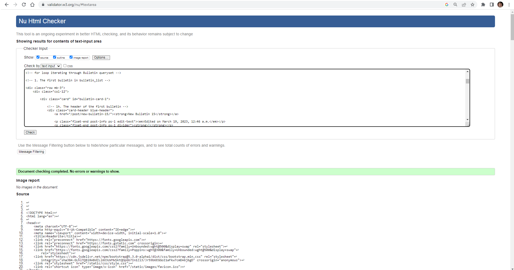
Index page (logged in): 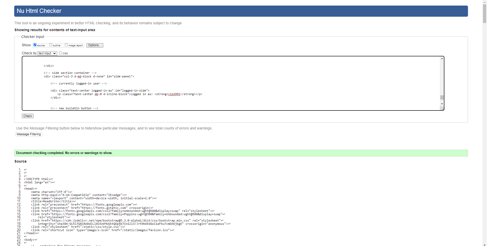
Bulletin page (not logged in): 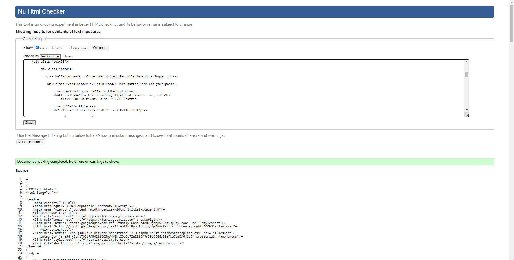
Bulletin page (logged in): 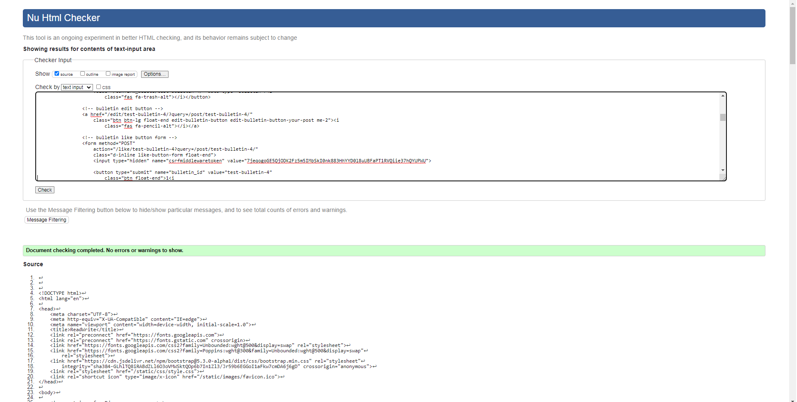
Add Bulletin page: 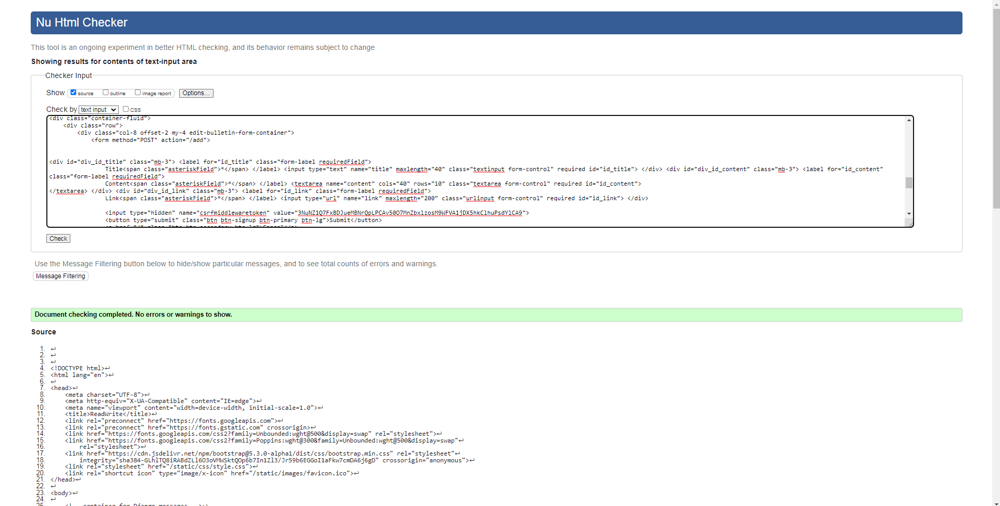
Edit Bulletin page: 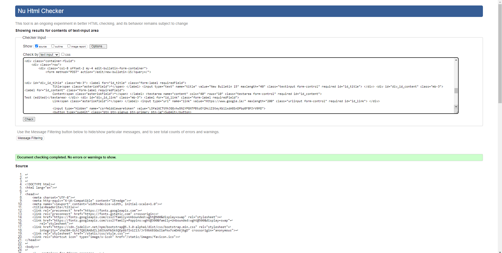
Edit Comment page: 
Sign Up page: 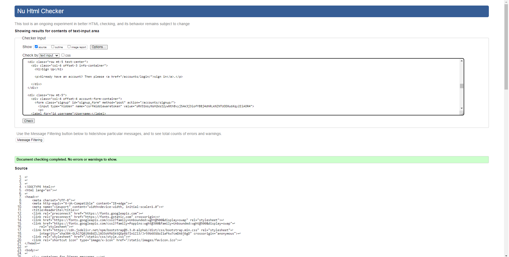
Sign In page: 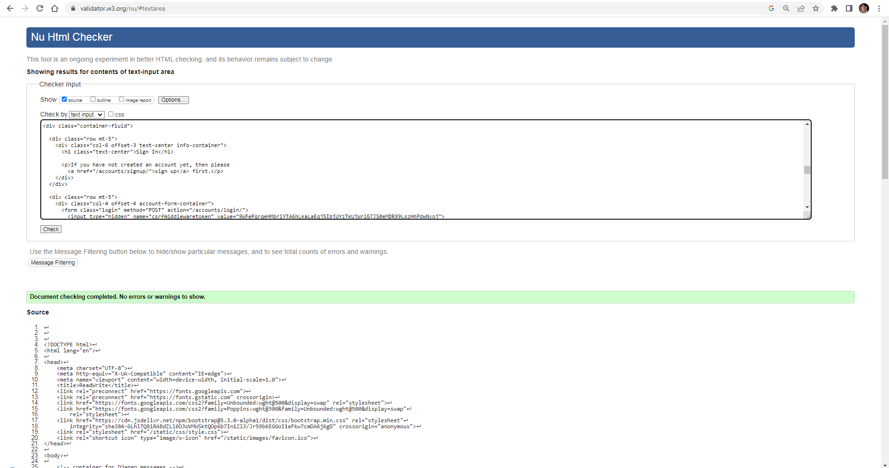
Sign Out page: 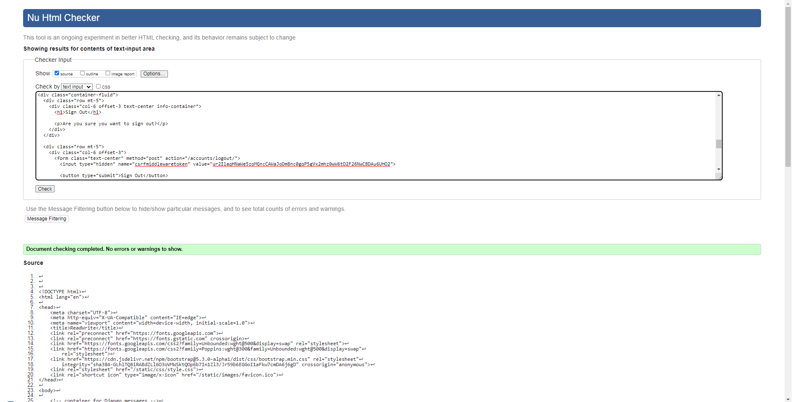
 

 

### Jigsaw (CSS validation)
 
style.css validation: 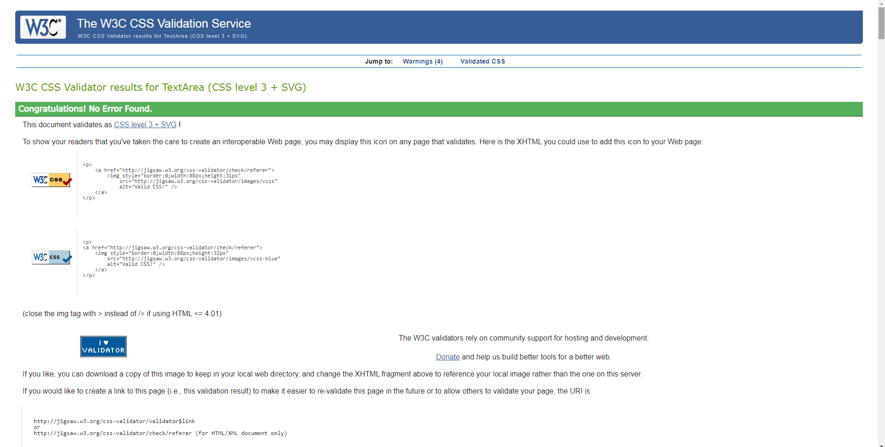
Warnings about use of vendor extensions: 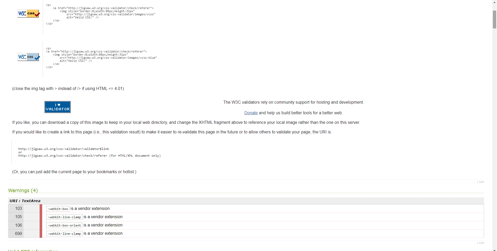
 

 

## Coverage Report

 
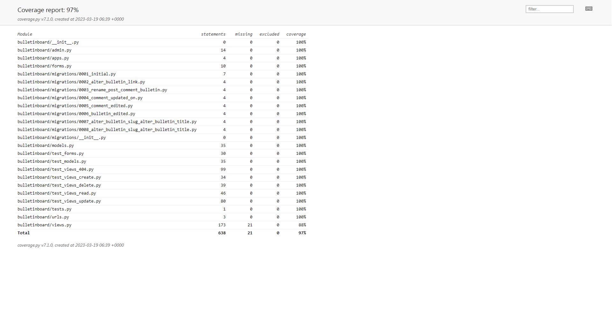